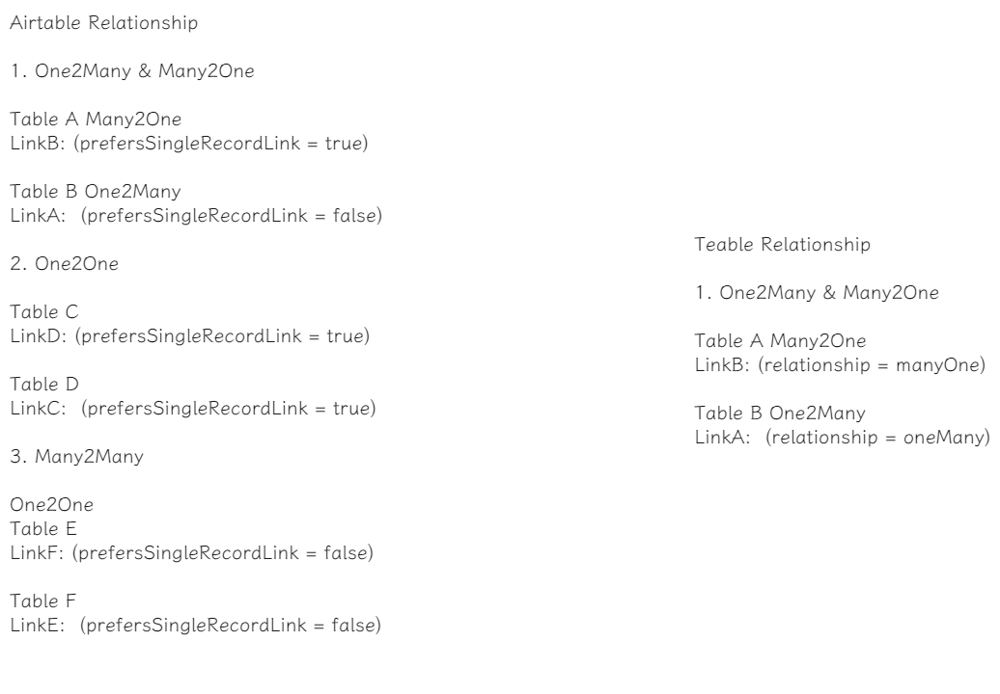

# airtable2teable

The data pipeline from airtable to teable.

## Prepare

Airtable's API uses token-based authentication, allowing users to authenticate API requests by inputting their tokens
into the HTTP authorization bearer token header.

Tokens can only access API endpoints covered by the scopes granted to them. Tokens serve as the account of the user who
grants access, with the following limitations:

- Scopes: What actions the token can perform.
- Resources/access: What bases and workspace the token can access. Tokens can be granted access to individual—or
  all—bases/workspaces. These can be listed using the list bases endpoint.

To import airtable Base data into a teable Workspace, the token requires the following
Scope: `data.records:read`, `schema.bases:read`.

## Quick Start

```typescript
const dbMigrate = new DBMigrate({
  from: {
    baseId: '',
    airtableToken: ''
  },
  to: {
    dirPath: `${__dirname}`
  }
});
const result = await dbMigrate.execute();
```

## Process:

airtable data model -> teable data model

- [x] singleLineText -> singleLineText √
- [x] email -> singleLineText √
- [x] url -> singleLineText √
- [x] multilineText -> singleLineText √
- [x] number -> number √
- [x] percent -> number √
- [x] currency -> number √
- [x] singleSelect -> singleSelect √
- [x] multipleSelects -> multipleSelects √
- [ ] singleCollaborator
- [ ] multipleCollaborators
- [ ] multipleRecordLinks
- [x] date -> datetime √
- [x] dateTime -> datetime √
- [x] phoneNumber -> singleLineText √
- [ ] multipleAttachments
- [x] checkbox -> checkbox √
- [ ] formula
- [x] createdTime -> datetime √
- [ ] rollup
- [ ] count
- [ ] lookup
- [ ] multipleLookupValues
- [x] autoNumber -> number √
- [x] barcode -> singleLineText √
- [x] rating -> rating √
- [x] richText -> singleLineText √
- [ ] duration
- [x] lastModifiedTime -> datetime √
- [ ] button
- [ ] createdBy
- [ ] lastModifiedBy
- [ ] externalSyncSource
- [ ] aiText

PS:

1. In airtable, timeZone "client" exist, but teable not. So default transform to Etc/GMT.
2. Link Relationship
